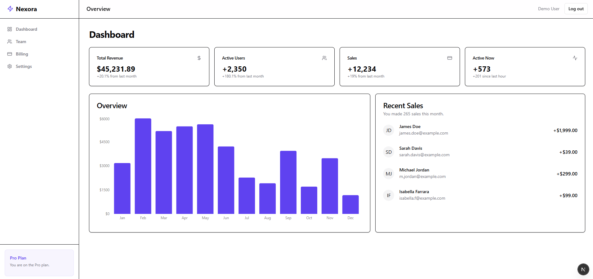

# Nexora SaaS Starter Kit (v2026)

A production-ready Next.js SaaS starter kit with Authentication, Multi-tenancy, and Billing preparation.



## Tech Stack

- **Framework**: Next.js 16 (App Router)
- **Language**: TypeScript
- **Styling**: Tailwind CSS (with highly customized Nexora design system)
- **Database**: PostgreSQL (via Prisma ORM)
- **Auth**: NextAuth.js (Auth.js v5)
- **Validation**: Zod
- **Forms**: React Hook Form (implemented manually via Server Actions)
- **Charts**: Recharts (for Analytics)

## Features

- **Authentication**: Full login/register flow using NextAuth v5 + Credential Provider.
- **Multi-Tenancy**: Database schema supports Organizations and Memberships.
- **Billing Ready**: Subscription and Organization models pre-configured for Stripe integration.
- **Role-Based Access**: Role field (OWNER, ADMIN, MEMBER) in database for authorization.
- **Premium UI**: Glassmorphism, dark mode support, and custom Tailwind primitives.
- **Server Actions**: All mutations handled via Next.js Server Actions.

## Getting Started

1.  **Clone the repository**
2.  **Install dependencies**:
    ```bash
    npm install
    ```
3.  **Setup Environment**:
    Refer to `.env` for setup. It is pre-configured with a shared Neon DB for demo purposes.
4.  **Initialize Database**:
    ```bash
    npx prisma generate
    npx prisma db push
    ```
5.  **Seed Demo Data**:
    ```bash
    npx prisma db seed
    ```
6.  **Run Development Server**:
    ```bash
    npm run dev
    ```

## Demo Credentials

You can log in with the pre-seeded account:
- **Email**: `demo@nexora.com`
- **Password**: `password123`

## Deployment

### Netlify

This project is ready for Netlify deployment:

1. Push your code to GitHub
2. Connect your repository to Netlify
3. Add the following environment variables in Netlify:
   - `DATABASE_URL`: Your PostgreSQL connection string (e.g., from Neon)
   - `AUTH_SECRET`: A secure random string (use `openssl rand -base64 32`)
   - `NEXTAUTH_URL`: Your deployed URL (e.g., `https://your-app.netlify.app`)
4. Deploy

The `netlify.toml` configuration and `postinstall` script will handle Prisma generation automatically.

## Architecture Decisions

### Multi-Tenancy
We use a **Schema-based Multi-tenancy** approach (logical separation) where every `Organization` has a unique ID, and users are mapped to organizations via `OrganizationMember`.
- **Middleware**: Can be extended to check for `orgId` in URL or session to enforce tenancy.
- **Data Access**: Always include `where: { organizationId: currentOrgId }` in Prisma queries.

### Authentication
We use **Auth.js v5 (NextAuth)**.
- **Config**: Split into `auth.config.ts` (edge-safe) and `auth.ts` (Node.js runtime with Prisma).
- **Middleware**: `middleware.ts` protects `/dashboard` routes.

### Role Enforcement
Roles (`OWNER`, `ADMIN`, `MEMBER`) are stored on the `OrganizationMember` table. Check these roles in Server Actions or UI components before allowing sensitive actions.

## Extending the Starter

- **Add Stripe**: Use the `stripeCustomerId` and implementation in `actions/billing` (to be created).
- **Add OAuth**: Add providers to `src/auth.ts` providers array.
- **Emails**: specific email provider integration (Resend/SendGrid) can be added in `auth.ts` email provider calling logic or separate actions.

## Folder Structure
- `src/app`: App Router pages.
- `src/components/ui`: Reusable UI primitives (Button, Input, etc.).
- `src/lib`: Utilities, database client.
- `src/actions`: Server Actions for mutations.
